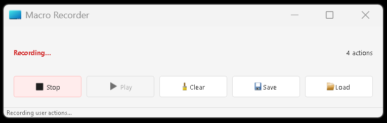

# Macro Recorder

A simple desktop app that lets you record and replay mouse and keyboard actions on your computer.

## What does it do?

This app helps you:

- Record mouse clicks and keyboard inputs
- Play them back exactly as you recorded them
- Save your macros to files so you can use them later
- Load your saved macros whenever you need them

Perfect for automating repetitive tasks, creating demos, or testing applications without writing a single line of code.

## Screenshots

### Ready to Record

*The app when first launched, ready to start recording your actions*

### Recording in Progress

*The app while recording your mouse and keyboard actions*

### Ready to Play

*After recording, the app shows how many actions were recorded and is ready to play them back*

## Features

- **Simple Recording**: Just hit record and do your thing - the app captures all your mouse clicks and keyboard presses
- **Accurate Playback**: Plays back your actions with the exact timing you recorded them
- **Save & Load**: Store your macros as JSON files and load them whenever you need
- **Clean Interface**: Simple, no-nonsense UI that shows you exactly what's happening
- **Background Processing**: Recording and playback happen in separate threads so the app stays responsive

## How to Install

1. Make sure you have Python installed (version 3.6 or newer)
2. Install the required packages:
   ```
   pip install PyQt5 keyboard mouse
   ```
3. Run the app:
   ```
   python app.py
   ```

## How to Use

### Recording Actions
1. Click the "Record" button
2. Do whatever actions you want to record (mouse clicks, keyboard typing)
3. Click "Stop" when you're done

### Playing Back Actions
1. Click the "Play" button to replay everything
2. Watch as your computer repeats exactly what you did
3. You can stop playback anytime by clicking "Stop"

### Saving and Loading
- Hit "Save" to store your macro to a JSON file
- Click "Load" to open a previously saved macro

## Technical Details

The app uses:
- PyQt5 for the user interface
- Multi-threading to keep everything running smoothly
- The `keyboard` and `mouse` libraries to capture and simulate inputs
- JSON format for saving macros

## Things to Know

- The app needs permissions to monitor and control your mouse and keyboard
- Some actions might not work in all applications due to security restrictions
- For best results, make sure windows are in the same position when recording and playing back

## License

This project is licensed under the MIT License - see the [LICENSE](LICENSE) file for details.
